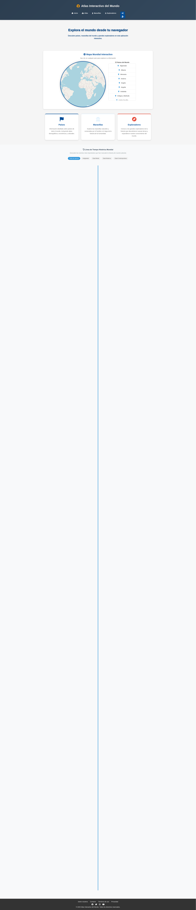
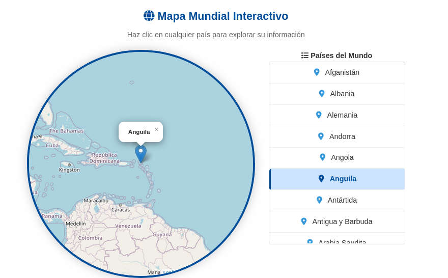

# 🌍 Proyecto Personal 2025 - Atlas Interactivo
## 📖 Descripción

Aplicación interactiva educativa para explorar información geográfica, histórica y cultural mediante mapas, quizzes y perfiles de civilizaciones y países.

## ✨ Funcionalidades

    🌐 Mapa interactivo y dinámico.

    🏛️ Secciones: Inicio, Maravillas del Mundo, Atlas, primera-guerra segunda-guerra.

    📱 Diseño responsivo para móviles y escritorio.

## 🔧 Stack utilizado

    Front-end: HTML5, CSS3, JavaScript

    Back-end: Python 3 con Flask

    Base de datos: SQLite

## 🧪 Cómo ejecutar el proyecto

# 1. Clonar el repositorio
git clone https://github.com/Aleeza951/Aleeza-proyecto-personal-2025.git

# 2. Entrar en el directorio
cd Aleeza-proyecto-personal-2025

# 3. Crear y activar entorno virtual
python3 -m venv venv
source venv/bin/activate

# 4. Ejecutar la app
python3 app.py

👉 Luego abre en el navegador: http://127.0.0.1:5000
🗂️ Estructura del proyecto

/static        - CSS y JavaScript  
/templates     - HTML de las vistas  
/data          - Archivos JSON con información histórica  
app.py         - Archivo principal de Flask  

## 📸 Capturas del Proyecto
Página de Inicio	
	

	

## ⚙️ Funcionalidades Clave
### 🧭 Mapa Interactivo

	

    El usuario puede hacer clic en continentes o países para ver información histórica.

    Datos cargados dinámicamente desde JSON.

🧙‍♂️ primera guerra segunda guerra
    Cada civilización tiene un perfil con historia, cultura y ubicación.

    Puedes agregar fácilmente más civilizaciones editando data/civilizaciones.json.

📚 Quizzes

    Preguntas interactivas con puntaje y respuestas inmediatas.

    Las preguntas se extraen de un archivo JSON y se cargan al azar.

📝 Notas

    Ideal para clases de historia y geografía.

    Fácil de ampliar con más contenido.

    Se pueden añadir funciones como audio, animaciones o búsqueda por países.

📬 Contacto

Aleeza Sajid
GitHub: @Aleeza951
Email: aleezas947@gmail.com
